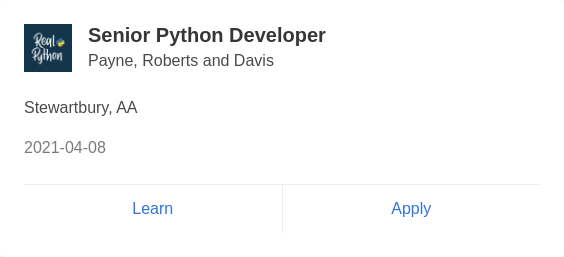

# news-job-ads-video

A small Java application that helps job seekers by turning **job advertisements from newspaper /
job websites into a clean video** that can be posted on YouTube, WhatsApp, etc.

To avoid reproducing copyrighted newspaper artwork, the app **does not screenshot the original
ads**. Instead it extracts only the *facts* of each job (role, company, location, qualification,
salary, contact, last date) and renders its **own branded slide** for every job. The slides are then
stitched into an MP4 with `ffmpeg`. The video also gets a spoken **voice-over** of each job (offline
text-to-speech) so it can be listened to as well as read; each slide is shown for as long as its
narration plays.

```
scrape (or load sample)  ->  filter job ads  ->  render one slide per job (Java2D)  ->  ffmpeg  ->  jobs.mp4
                                                  \-> narrate each job (TTS) ----------/
```

## Example output

A generated job slide and intro card (shown in the video):


## Proof-of-source evidence (authenticity)

The video only ever shows our own re-rendered slides. But for **trust**, when scraping real sites the
app also saves a separate `evidence/` archive so you can prove where each ad came from if anyone
questions it. For every ad it captures:

- a **screenshot of the actual ad** as it appears on the source page (via headless Chrome),
- the **original ad image** when the listing is itself an image (e.g. e-paper clippings),
- a full-page screenshot of the source page for context, and
- a **`manifest.json`** recording the source name, page URL, ad link and a capture **timestamp**.

Example captured ad screenshot:



This archive is **not** included in the video — it is your proof, kept on the side.

## Requirements

- Java 17+
- Maven 3.6+
- `ffmpeg` on your `PATH` (used to build the video and mux the narration audio)
- A text-to-speech engine for narration (optional, any one):
  1. **Piper** (`pip install piper-tts`) + the Indian-English voice model `en_IN-spicor-medium`
     (natural Indian accent, recommended). Place the `.onnx` + `.onnx.json` in
     `~/piper-voices/` or set `PIPER_MODEL=/path/to/model.onnx`.
  2. *(Optional)* **Malayalam voice** `ml_IN-meera-medium` for Mathrubhumi/Malayalam-language slides.
     Place it in `~/piper-voices/` alongside the English model. When present the app automatically
     narrates slides containing Malayalam text with the Malayalam voice.
  3. **espeak-ng** (`sudo apt install espeak-ng`) — lighter, robotic but correct numbers.
  4. **pico2wave** (`sudo apt install libttspico-utils`) — smooth but reads numbers digit-by-digit.
  If none is installed the app just produces a silent video.
- **Google Chrome / Chromium** installed (only needed for evidence capture when scraping real sites;
  not needed for `--sample`). The matching `chromedriver` is fetched automatically by Selenium
  Manager. If Chrome is in a non-standard location, set `CHROME_BINARY=/path/to/chrome` (or
  `-Dchrome.binary=...`).

On Ubuntu/Debian:
```bash
sudo apt-get install -y maven ffmpeg espeak-ng libttspico-utils
pip install piper-tts   # recommended for Indian-English neural voice
# Download the Indian English voice model:
mkdir -p ~/piper-voices
curl -sL 'https://huggingface.co/navgurukul-ai-labs/text-to-speech-en-IN-piper/resolve/main/en_IN-dataset%3Dspicor-english-base%3Dljspeech-epochs%3D1089.onnx' -o ~/piper-voices/en_IN-spicor-medium.onnx
curl -sL 'https://huggingface.co/navgurukul-ai-labs/text-to-speech-en-IN-piper/resolve/main/en_IN-dataset%3Dspicor-english-base%3Dljspeech-epochs%3D1089.onnx.json' -o ~/piper-voices/en_IN-spicor-medium.onnx.json
# (Optional) Download the Malayalam voice model for Mathrubhumi Thozhil Vartha:
curl -sL 'https://huggingface.co/rhasspy/piper-voices/resolve/main/ml/ml_IN/meera/medium/ml_IN-meera-medium.onnx' -o ~/piper-voices/ml_IN-meera-medium.onnx
curl -sL 'https://huggingface.co/rhasspy/piper-voices/resolve/main/ml/ml_IN/meera/medium/ml_IN-meera-medium.onnx.json' -o ~/piper-voices/ml_IN-meera-medium.onnx.json
```

## Build

```bash
mvn clean package
```

This produces a runnable fat-jar at `target/news-job-ads-video.jar`.

## Run

### 1. Try it immediately with sample data (no network needed)

```bash
java -jar target/news-job-ads-video.jar --sample --out jobs.mp4 --brand "Daily Job Alerts"
```

This reads [`src/main/resources/sample-jobs.json`](src/main/resources/sample-jobs.json), renders a
slide per job and writes `jobs.mp4`.

### 2. Scrape real websites

Describe each site in a `sources.json` (see
[`src/main/resources/sources.json`](src/main/resources/sources.json) for the format) and run:

```bash
java -jar target/news-job-ads-video.jar --sources sources.json --out jobs.mp4
```

Every site has a different HTML layout, so you set the CSS selectors per site:

```json
[
  {
    "name": "Example Job Board",
    "url": "https://example-job-board.com/listings",
    "itemSelector": "div.job-card",
    "titleSelector": "h2.job-title",
    "companySelector": ".company-name",
    "locationSelector": ".job-location",
    "linkSelector": "a"
  }
]
```

To find the right selectors: open the page in a browser, right-click an ad → **Inspect**, and note
the element/class that wraps each listing.

### Options

| Flag | Default | Meaning |
|------|---------|---------|
| `--sample` | off | Use bundled sample data instead of scraping |
| `--sources <file>` | – | Path to a `sources.json` of sites to scrape |
| `--out <file>` | `jobs.mp4` | Output video path |
| `--brand <text>` | `Job Alerts` | Title shown in the slide header |
| `--seconds <n>` | `5` | Seconds each slide is shown (used for slides without narration; with narration each slide lasts as long as its voice-over) |
| `--fps <n>` | `25` | Video frame rate |
| `--limit <n>` | none | Cap the number of jobs |
| `--evidence <dir>` | `<out>/evidence` | Where to save proof-of-source evidence |
| `--no-evidence` | off | Skip capturing evidence screenshots |
| `--no-audio` | off | Skip the spoken narration (otherwise on when a TTS engine is available) |
| `--disclaimer <text>` | built-in default | Disclaimer card shown & narrated right after the intro |
| `--no-disclaimer` | off | Omit the disclaimer card |

## Project layout

```
src/main/java/com/jobads/
  App.java                  # entry point – wires the pipeline
  model/JobPosting.java     # plain job facts (no images)
  scraper/JobScraper.java   # jsoup-based scraping
  scraper/SiteConfig.java   # per-site selector config
  filter/JobFilter.java     # keep job ads, drop noise
  scraper/EvidenceCapture.java # screenshot the real ads as proof (headless Chrome)
  image/SlideGenerator.java # render a clean slide per job (Java2D)
  audio/Narrator.java       # spoken voice-over per job (offline TTS)
  video/VideoBuilder.java   # combine slides into mp4 via ffmpeg (+ mux narration)
  model/EvidenceItem.java   # one manifest entry of captured proof
```

## Legal / ethical note

Always check a website's **Terms of Service** and `robots.txt` before scraping it, and prefer
sources that offer an RSS feed or official API. This tool intentionally re-renders the job details
into original slides rather than copying the newspaper's own ad images.

## Deploying on AWS (optional)

Because the job is a periodic batch (e.g. produce one video per day), the simplest deployment is:

- **AWS Lambda + EventBridge schedule** to run the jar on a cron, writing the video to **S3**; or
- **ECS Fargate scheduled task** running the Docker image; or
- **Elastic Beanstalk** if you later wrap it in a web service.

`ffmpeg` (and Chrome/Chromium, if you want evidence capture) must be available in the runtime — e.g.
as Lambda layers or baked into the container image.
